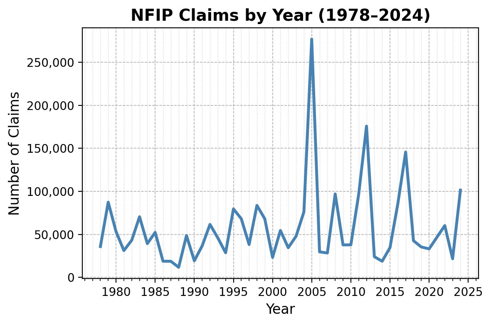
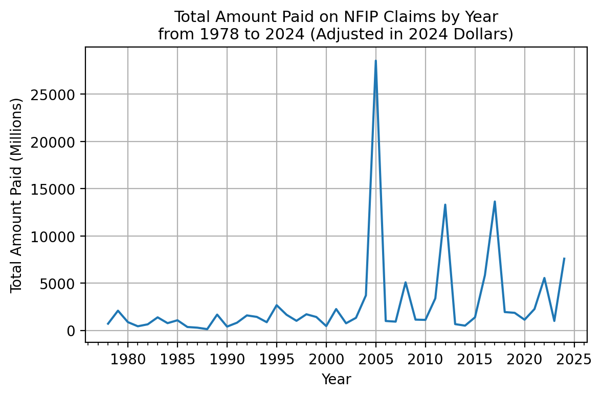

# Analyzing FEMA's National Flood Insurance Program (NFIP) Data With DuckDB
Author: Mark Bauer

|   countClaimsM |   paidTotalClaimM |   paidBuildingClaimM |   paidContentsClaimM |   paidICCM |
|---------------:|------------------:|---------------------:|---------------------:|-----------:|
|        2.67149 |           80638.4 |              65049.6 |              14640.3 |    948.437 |

|   rank |   yearOfLoss | floodEvent               |   countClaims |   paidTotalClaimM |   paidTotalClaimM2023 |   paidAverageClaim2023 |
|-------:|-------------:|:-------------------------|--------------:|------------------:|----------------------:|-----------------------:|
|      1 |         2005 | Hurricane Katrina        |        208348 |             16261 |                 25371 |                 121772 |
|      2 |         2012 | Hurricane Sandy          |        144848 |              8956 |                 11886 |                  82062 |
|      3 |         2017 | Hurricane Harvey         |         92396 |              9055 |                 11256 |                 121830 |
|      4 |         2022 | Hurricane Ian            |         48721 |              4757 |                  4953 |                 101664 |
|      5 |         2008 | Hurricane Ike            |         58126 |              2702 |                  3824 |                  65799 |
|      6 |         2016 | Mid-summer severe storms |         30017 |              2533 |                  3216 |                 107150 |
|      7 |         2004 | Hurricane Ivan           |         20137 |              1325 |                  2137 |                 106170 |
|      8 |         2001 | Tropical Storm Allison   |         35561 |              1104 |                  1901 |                  53461 |
|      9 |         2011 | Hurricane Irene          |         52493 |              1347 |                  1825 |                  34770 |
|     10 |         2021 | Hurricane Ida            |         28317 |              1346 |                  1514 |                  53480 |

# 1. Introduction
I've been enjoying [DuckDB](https://duckdb.org/) for the past few weeks, particularly how smooth the Python API feels. With its impressive speed and friendly SQL interface, analyzing moderately large datasets within a Jupyter Notebook is almost effortless. This project aims to demonstrate just how excited I am to use and to learn more about this incredible tool.

The analysis presented here is solely focused on the [FIMA NFIP Redacted Claims](https://www.fema.gov/openfema-data-page/fima-nfip-redacted-claims-v2) dataset, which fortunately is available in Parquet format. With more than 2M rows, this dataset provides detailed information about the [National Flood Insurance Program (NFIP)](https://www.floodsmart.gov/about) claims transations and is redated to protect policy holders.

Given the substantial size of this dataset, it provided an opportunity to explore and utilize DuckDB, a high-performance analytical database. While this guide offers valuable insights, users are encouraged to supplement their understanding by referring to the [official documentation](https://duckdb.org/docs/) provided on DuckDB's website.

Program URL: https://www.fema.gov/flood-insurance
FloodSmart: https://www.floodsmart.gov/historical-nfip-claims-information-and-trends?map=countries/us/us-all&region=us&miny=all&maxy=all&county=&gtype=country

# 2. Notebook
- [NFIP Redacted Claims Analysis](https://github.com/mebauer/duckdb-fema-nfip/blob/main/analysis.ipynb): Explore NFIP Claims data with DuckDB with ease.
- [Download Data](https://github.com/mebauer/duckdb-fema-nfip/blob/main/download-data.ipynb): Demonstrates how to download the NFIP Redacted Claims dataset from OpenFEMA.
- [Figures](https://github.com/mebauer/duckdb-fema-nfip/blob/main/figures.ipynb): This notebook is dedicated to generating figures and tables displayed on this page. For a more detailed analysis of the NFIP data, refer to the [analysis.ipynb](https://github.com/mebauer/duckdb-fema-nfip/blob/main/analysis.ipynb) notebook.

# 3. Data 
OpenFEMA Dataset: FIMA NFIP Redacted Claims - v2. Retrieved from https://www.fema.gov/openfema-data-page/fima-nfip-redacted-claims-v2. This product uses the FEMA OpenFEMA API, but is not endorsed by FEMA. The Federal Government or FEMA cannot vouch for the data or analyses derived from these data after the data have been retrieved from the Agency's website(s).

Please refer to the [OpenFEMA Terms and Conditions](https://www.fema.gov/about/openfema/terms-conditions) for further information regarding the usage and access of OpenFEMA datasets.

# 4. Additional Resources
## FEMA:
- NFIP:
    - Historical NFIP Claims Information and Trends: https://www.floodsmart.gov/historical-nfip-claims-information-and-trends?map=countries/us/us-all&region=us&miny=all&maxy=all&county=&gtype=country
    - Flood Insurance Data and Analytics: https://nfipservices.floodsmart.gov/reports-flood-insurance-data
    - Frequently Asked Questions about NFIP Policies and Claims Data: https://nfipservices.floodsmart.gov/frequently-asked-questions-about-nfip-policies-and-claims-data
- OpenFEMA:
    - FEMA NFIP Claims and Policy Data Press Release (2019): https://www.fema.gov/press-release/20230425/fema-publishes-nfip-claims-and-policy-data
    - OpenFEMA Dataset: FIMA NFIP Redacted Claims - v2: https://www.fema.gov/openfema-data-page/fima-nfip-redacted-claims-v2
    - OpenFEMA Dataset: FIMA NFIP Redacted Policies - v2: https://www.fema.gov/openfema-data-page/fima-nfip-redacted-policies-v2
    
## Academic Research:
- Wing, O.E.J., Pinter, N., Bates, P.D. *et al*. New insights into US flood vulnerability revealed from flood insurance big data. *Nat Commun* **11**, 1444 (2020). https://doi.org/10.1038/s41467-020-15264-2

## NFIP Redacted Claims & Policies Analysis:
**The Wharton School of the University of Pennsylvania**  
- Flood Insurance in the US: Lessons from FEMA’s Recent Data Release (2020):
    - Part I: https://esg.wharton.upenn.edu/news/flood-insurance-in-the-us-lessons-from-femas-recent-data-release-part-i/
    - Part II: https://esg.wharton.upenn.edu/climate-center/flood-insurance-in-the-us-lessons-from-femas-recent-data-release-part-ii/
    
**The Natural Resources Defense Council (NRDC)**  
- FEMA Flood Data: 2.4 Million Damage Claims and Counting (2019): https://www.nrdc.org/bio/anna-weber/fema-flood-data-24-million-damage-claims-and-counting
- FEMA Flood Data: What We Still Need to Know (2019): https://www.nrdc.org/bio/anna-weber/fema-flood-data-what-we-still-need-know
- FEMA Puts New Data on the Map for Policymakers (2020): https://www.huduser.gov/portal/periodicals/cityscpe/vol22num1/ch10.pdf

**Verisk**
- Modeling Fundamentals: Evaluating U.S. Flood Model Loss Output with Historical Loss Experience (2020): https://www.verisk.com/blog/modeling-fundamentals-evaluating-u-s--flood-model-loss-output-with-historical-loss-experience/

**Insurance Information Institute**
- Facts + Statistics: Flood insurance: https://www.iii.org/fact-statistic/facts-statistics-flood-insurance
    
## Community Open Data:
**Norfolk Open Data**  
- Norfolk Claims from the FEMA National Flood Insurance Program: https://data.norfolk.gov/stories/s/FEMA-National-Flood-Insurance-Program-Redacted-Cla/gi5t-nkzw/
- FEMA NFIP Claims Dataset: https://data.norfolk.gov/Government/FEMA-NFIP-Claims/suf7-r643/about_data

## Other:
**DHS/FEMA**    
- DHS/FEMA/PIA-050 National Flood Insurance Program (NFIP) PIVOT System (2018): https://www.dhs.gov/publication/dhsfemapia-050-national-flood-insurance-program-nfip-pivot-system
    
**OIG**  
- FIMA Made Progress Modernizing Its NFIP System, but Data Quality Needs Improvement (2020): https://www.oig.dhs.gov/sites/default/files/assets/2020-11/OIG-21-04-Nov20.pdf 

# 5. Say Hello!
Feel free to reach out.
- LinkedIn: [markebauer](https://www.linkedin.com/in/markebauer/)   
- Portfolio: [mebauer.github.io](https://mebauer.github.io/)
- GitHub: [mebauer](https://github.com/mebauer) 
