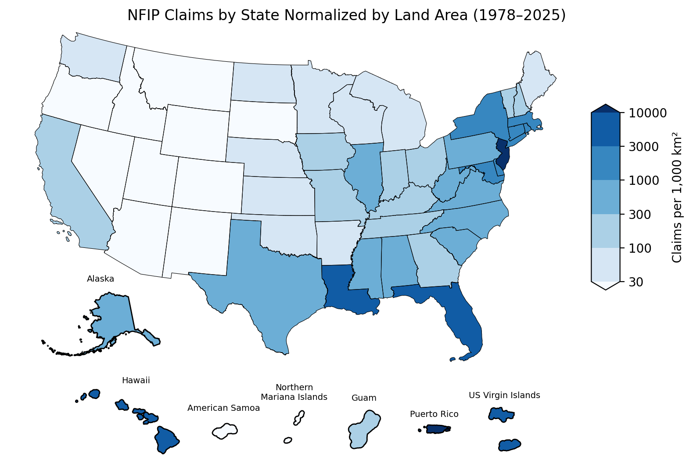

# Analyzing FEMA's National Flood Insurance Program (NFIP) Data With DuckDB
Author: Mark Bauer

### Table of Contents
* [1. Introduction](#1-Introduction)  
* [2. Notebooks](#2-Notebooks)  
* [3. Data](#3-Data)  
* [4. Additional Resources](#4-Additional-Resources) 
    * [FEMA](#FEMA) 
    * [Academic Research](#Academic-Research) 
    * [NFIP Redacted Claims & Policies Analysis](#NFIP-Redacted-Claims--Policies-Analysis) 
    * [Community Open Data](#Community-Open-Data)
    * [Other](#Other)
* [5. Say Hello!](#5-Say-Hello)  

### Disclaimer

This guide is intended for illustrative purposes only and was created to share methods I’ve found helpful when working with NFIP datasets, particularly within the open source community. FEMA does not endorse any of the products mentioned in this guide and makes no claim as to the assurance of their efficacy or to the security of the products. See below for the language suggested by OpenFEMA.

This analysis uses the Federal Emergency Management Agency’s OpenFEMA API, but is not endorsed by FEMA. The Federal Government or FEMA cannot vouch for the data or analyses derived from these data after the data have been retrieved from the Agency's website(s).

From OpenFEMA:

>Respect the OpenFEMA API and content on this website. Use the Site in a lawful manner. Do not modify the Site or attempt to use it to publish or transmit malicious software or content. FEMA shall not be liable for any damages resulting from the use of this website, API services, or content. Do not attempt to reidentify the individuals whose data may be aggregated. We may suspend your access to this website if we feel you have not complied with these terms and conditions.

Read more about OpenFEMA's [Terms and Conditions](https://www.fema.gov/about/openfema/terms-conditions).

--------------- 

Last Data Refresh: 05-14-2025.

**Table xx. Number and Amount Paid on NFIP Claims (both in millions).** Total amount paid, in this analysis, is defined as the total amount paid for all Building, Contents, and Increased Cost of Compliance (ICC) claims. This table includes claims from 1978 through the most recent effective data refresh specified above.
|   countClaimM |   paidTotalClaimM |   paidBuildingM |   paidContentsM |   paidICCM |
|--------------:|------------------:|----------------:|----------------:|-----------:|
|          2.71 |         88,145.83 |       71,665.54 |       15,528.23 |     952.06 |

 

**Figure xx. Number of NFIP Claims by Year from 1978 to 2024.**

**Figure xx. Total Amount Paid on NFIP Claims by Year from 1978 to 2024 (Adjusted in 2024 Dollars).**

 

**Table xx. Top 10 Costliest Flood Events by NFIP Claim Payments (in millions).** Ranked by total amount paid, adjusted to 2025 dollars (i.e. paidTotalClaimM2025). Original payment amounts at the time of each event are shown in paidTotalClaimM.
|   rank |   yearOfLoss | floodEvent               |   countClaims |   paidTotalClaimM |   paidTotalClaimM2025 |   averagePaidClaim2025 |
|-------:|-------------:|:-------------------------|--------------:|------------------:|----------------------:|-----------------------:|
|      1 |         2005 | Hurricane Katrina        |        208348 |          16261.70 |              27088.99 |                 130017 |
|      2 |         2012 | Hurricane Sandy          |        144848 |           8957.47 |              12553.89 |                  86669 |
|      3 |         2017 | Hurricane Harvey         |         92398 |           9055.71 |              11846.27 |                 128209 |
|      4 |         2024 | Hurricane Helene         |         57843 |           6027.67 |               6208.53 |                 107334 |
|      5 |         2022 | Hurricane Ian            |         48754 |           4838.68 |               5467.26 |                 112139 |
|      6 |         2008 | Hurricane Ike            |         58126 |           2702.51 |               4067.22 |                  69972 |
|      7 |         2016 | Mid-summer severe storms |         30018 |           2533.53 |               3397.11 |                 113169 |
|      8 |         2004 | Hurricane Ivan           |         20137 |           1325.42 |               2273.47 |                 112900 |
|      9 |         2001 | Tropical Storm Allison   |         35561 |           1104.98 |               2004.68 |                  56373 |
|     10 |         2011 | Hurricane Irene          |         52493 |           1347.40 |               1943.62 |                  37026 |

 

**Figure xx. Number of NFIP Claims by State from 1978 to 2025.**

**Figure xx. Number of NFIP Claims Normalized by State Area from 1978 to 2025.**

# 1. Introduction
The [National Flood Insurance Program](https://www.fema.gov/flood-insurance) (NFIP) is managed by [FEMA](https://www.fema.gov/) and provides flood insurance to mitigate the socio-economic impacts of floods. In 2019, FEMA [released](https://www.fema.gov/press-release/20230425/fema-publishes-nfip-claims-and-policy-data) two datasets on [OpenFEMA](https://www.fema.gov/about/reports-and-data/openfema) related to the NFIP to promote transparency, reduce complexity for public data requests, and to improve how the agency’s stakeholders interact with and understand the NFIP:

1) [NFIP Redacted Policies](https://www.fema.gov/openfema-data-page/fima-nfip-redacted-policies-v2): This dataset provides details on NFIP policy transactions.
2) [NFIP Redacted Claims](https://www.fema.gov/openfema-data-page/fima-nfip-redacted-claims-v2): This dataset represents more than 2,000,000 claims transactions.

With over 69 million policies and 2.7 million claims transactions as of May 14, 2025, this is one of the largest openly available insurance datasets in the United States and possibly the world. This project examines both the NFIP Redacted Claims and Policies datasets, but more importantly, demonstrates how to query and manipulate the data with ease.

Due to its large file size, accessing the dataset can be a challenge, even for experienced analysts. [Guidance](https://www.fema.gov/openfema-data-page/fima-nfip-redacted-claims-v2) from OpenFEMA:
>In order to improve accessibility, we have one compressed file. Due to the file size we recommend using Access, SQL, or another programming/data management tool to visualize and manipulate the data, as Excel will not be able to process files this large without data loss.

OpenFEMA also provides a lot of great recommendations with their guide [OpenFEMA Guide to Working with Large Data Sets](https://www.fema.gov/about/openfema/working-with-large-data-sets).
>Once data has been successfully downloaded, viewing, manipulating, and analyzing data can be a challenge. A spreadsheet program such as Microsoft Excel has a data size limit. Large data sets will exceed spreadsheet tool row limits and will not open without data loss. Common text editors such as Notepad++ or Sublime have 2 GB file limits, again preventing the opening, search, and editing capabilities from working. Using different tools, extracting subsets, and/or aggregating detailed data are good approaches for making analysis easier.

To address this, I designed a tutorial demonstrating how to analyze the datasets with my laptop locally. To achieve this, I utilized [DuckDB](https://duckdb.org/), a lightweight, high-performance SQL OLAP database management system. DuckDB offers a smooth experience, is blazing-fast, includes a robust Python API, and is open-source. I used SQL via the [Python Client API](https://duckdb.org/docs/api/python/overview.html) for data analysis and used [GeoPandas](https://geopandas.org/en/stable/) for mapping.

The ultimate goal of this project is to promote the dataset for academic research and to assist communities in analyzing and downloading the data. This dataset is one of my favorites, and I hope you find these tutorials helpful in advancing the study and analysis of the NFIP.

To learn more about the NFIP:
- [NFIP Website](https://www.fema.gov/flood-insurance): NFIP information from FEMA.
- [FloodSmart](https://www.floodsmart.gov/): For more information about what’s covered and to find a policy.

In the [Additional Resources](#4-Additional-Resources) section, you’ll find some of my favorite reports and analyses related to the NFIP, particularly from the early days of the datasets' release. I highly recommend checking them out.

# 2. Notebooks
- [Download Data](https://github.com/mebauer/duckdb-fema-nfip/blob/main/download-data.ipynb): Demonstrates how to download the NFIP Claims dataset from OpenFEMA.
- [Analysis](https://github.com/mebauer/duckdb-fema-nfip/blob/main/analysis.ipynb): Explores NFIP Claims data with DuckDB with ease.
- [Generate Figures](https://github.com/mebauer/duckdb-fema-nfip/blob/main/figures.ipynb): Dedicated to generating figures and tables displayed on this page. For a more detailed analysis of the NFIP data, refer to the [analysis.ipynb](https://github.com/mebauer/duckdb-fema-nfip/blob/main/analysis.ipynb) notebook.
- [Metadata](https://github.com/mebauer/duckdb-fema-nfip/blob/main/metadata.ipynb): Examines the metadata for the NFIP Claims dataset. Here, we retrieve and save the [data dictionary](https://github.com/mebauer/duckdb-fema-nfip/blob/main/data-dictionary.csv).

# 3. Data 
OpenFEMA Datasets:
- FIMA NFIP Redacted Claims - v2. Retrieved from https://www.fema.gov/openfema-data-page/fima-nfip-redacted-claims-v2.
- FIMA NFIP Redacted Policies - v2. Retrieved from https://www.fema.gov/openfema-data-page/fima-nfip-redacted-policies-v2.

# 4. Additional Resources
## FEMA:
- NFIP:
    - [Historical NFIP Claims Information and Trends](https://www.floodsmart.gov/historical-nfip-claims-information-and-trends?map=countries/us/us-all&region=us&miny=all&maxy=all&county=&gtype=country)
    - [Flood Insurance Data and Analytics](https://nfipservices.floodsmart.gov/reports-flood-insurance-data)
    - [Frequently Asked Questions about NFIP Policies and Claims Data](https://nfipservices.floodsmart.gov/frequently-asked-questions-about-nfip-policies-and-claims-data)
- OpenFEMA:
    - [FEMA NFIP Claims and Policy Data Press Release (2019)](https://www.fema.gov/press-release/20230425/fema-publishes-nfip-claims-and-policy-data)
    - [OpenFEMA Dataset: FIMA NFIP Redacted Claims - v2](https://www.fema.gov/openfema-data-page/fima-nfip-redacted-claims-v2)
    - [OpenFEMA Dataset: FIMA NFIP Redacted Policies - v2](https://www.fema.gov/openfema-data-page/fima-nfip-redacted-policies-v2)
    
## Academic Research:
- Wing, O.E.J., Pinter, N., Bates, P.D. *et al*. New insights into US flood vulnerability revealed from flood insurance big data. *Nat Commun* **11**, 1444 (2020). https://doi.org/10.1038/s41467-020-15264-2

## NFIP Redacted Claims & Policies Analysis:
**The Wharton School of the University of Pennsylvania**  
- Flood Insurance in the US: Lessons from FEMA’s Recent Data Release (2020):
    - [Part I](https://esg.wharton.upenn.edu/news/flood-insurance-in-the-us-lessons-from-femas-recent-data-release-part-i/)
    - [Part II](https://esg.wharton.upenn.edu/climate-center/flood-insurance-in-the-us-lessons-from-femas-recent-data-release-part-ii/)
    
**The Natural Resources Defense Council (NRDC)**  
- [FEMA Flood Data: 2.4 Million Damage Claims and Counting (2019)](https://www.nrdc.org/bio/anna-weber/fema-flood-data-24-million-damage-claims-and-counting)
- [FEMA Flood Data: What We Still Need to Know (2019)](https://www.nrdc.org/bio/anna-weber/fema-flood-data-what-we-still-need-know)
- [FEMA Puts New Data on the Map for Policymakers (2020)](https://www.huduser.gov/portal/periodicals/cityscpe/vol22num1/ch10.pdf)
i
**Milliman**
- [Residential Flood Risk in the United States: Quantifying Flood Losses, Mortgage Risk and Sea Level Rise (2020)](https://www.soa.org/globalassets/assets/files/resources/research-report/2020/soa-flood-report.pdf)
- [Insights into consumer demand for flood insurance: Trends in take-up (2021)](https://www.milliman.com/en/insight/insights-into-consumer-demand-for-flood-insurance-trends-in-take-up)
- [Estimating undisclosed flood risk in real estate transactions (2025)](https://edge.sitecorecloud.io/millimaninc5660-milliman6442-prod27d5-0001/media/Milliman/PDFs/2025-Articles/1-13-25_NRDC_Estimating-Undisclosed-Flood-Risk.pdf)

**Verisk**
- [Modeling Fundamentals: Evaluating U.S. Flood Model Loss Output with Historical Loss Experience (2020](https://www.verisk.com/blog/modeling-fundamentals-evaluating-u-s--flood-model-loss-output-with-historical-loss-experience/)

**Insurance Information Institute**
- [Spotlight on: Flood insurance (2024)](https://www.iii.org/article/spotlight-on-flood-insurance)
- [Facts + Statistics: Flood insurance (2024)](https://www.iii.org/fact-statistic/facts-statistics-flood-insurance)
    
## Community Open Data:
**Norfolk Open Data**  
- [Norfolk Claims from the FEMA National Flood Insurance Program](https://data.norfolk.gov/stories/s/FEMA-National-Flood-Insurance-Program-Redacted-Cla/gi5t-nkzw/)
- [FEMA NFIP Claims Dataset](https://data.norfolk.gov/Government/FEMA-NFIP-Claims/suf7-r643/about_data)

## Other:
**DHS/FEMA**    
- [DHS/FEMA/PIA-050 National Flood Insurance Program (NFIP) PIVOT System (2018)](https://www.dhs.gov/publication/dhsfemapia-050-national-flood-insurance-program-nfip-pivot-system)

# 5. Say Hello!
Feel free to reach out.
- LinkedIn: [markebauer](https://www.linkedin.com/in/markebauer/)   
- Portfolio: [mebauer.github.io](https://mebauer.github.io/)
- GitHub: [mebauer](https://github.com/mebauer) 
