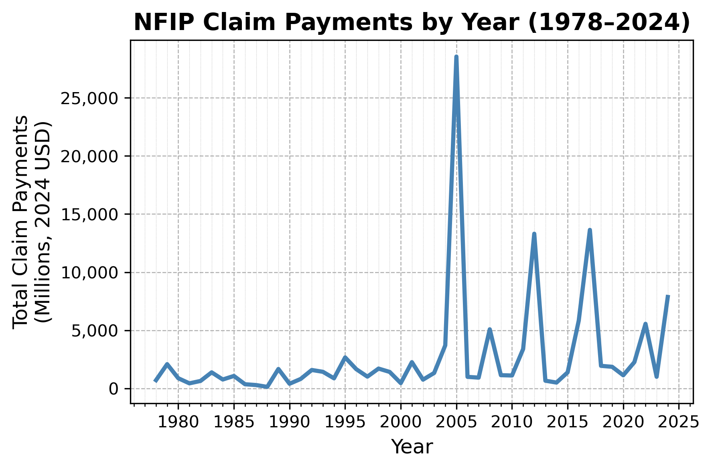

# Analyzing FEMA's National Flood Insurance Program (NFIP) Data With DuckDB
Author: Mark Bauer

### Table of Contents
* [1. Introduction](#1-Introduction)  
* [2. Notebooks](#2-Notebooks)  
* [3. Data](#3-Data)  
* [4. Additional Resources](#4-Additional-Resources) 
    * [FEMA](#FEMA) 
    * [Academic Research](#Academic-Research) 
    * [NFIP Redacted Claims & Policies Analysis](#NFIP-Redacted-Claims--Policies-Analysis) 
    * [Community Open Data](#Community-Open-Data)
    * [Other](#Other)
* [5. Say Hello!](#5-Say-Hello)  

Note: This analysis uses the Federal Emergency Management Agency’s OpenFEMA API, but is not endorsed by FEMA. The Federal Government or FEMA cannot vouch for the data or analyses derived from these data after the data have been retrieved from the Agency's website(s).

Read more about OpenFEMA's [Terms and Conditions](https://www.fema.gov/about/openfema/terms-conditions).

Data as of 10-04-2024.

-- 

Table xx. Number and Amount Paid on NFIP Claims (both in millions). Total amount paid, in this analysis, is defined as the total amount paid for all Building, Contents, and Increased Cost of Compliance (ICC) claims.
|   countClaimsM |   paidTotalClaimM |   paidBuildingClaimM |   paidContentsClaimM |   paidICCM |
|---------------:|------------------:|---------------------:|---------------------:|-----------:|
|           2.67 |           80638.4 |              65049.6 |              14640.3 |     948.44 |

Figure xx. Number of NFIP Claims by Year.

Figure xx. Total Amount Paid on NFIP Claims by Year (Adjusted in 2023 Dollars).

Table xx. Top 10 Most Costly Flood Events By Total Amount Paid on NFIP Claims ($ millions). Table is ranked on Total Amount Paid in 2023 dollars (i.e. paidTotalClaimM2023). The column paidTotalClaimM is the amount paid ($ millions) when occurred.
|   rank |   yearOfLoss | floodEvent               |   countClaims |   paidTotalClaimM |   paidTotalClaimM2023 |   averagePaidClaim2023 |
|-------:|-------------:|:-------------------------|--------------:|------------------:|----------------------:|-----------------------:|
|      1 |         2005 | Hurricane Katrina        |        208348 |             16261 |                 25371 |                 121772 |
|      2 |         2012 | Hurricane Sandy          |        144848 |              8956 |                 11886 |                  82062 |
|      3 |         2017 | Hurricane Harvey         |         92396 |              9055 |                 11256 |                 121830 |
|      4 |         2022 | Hurricane Ian            |         48721 |              4757 |                  4953 |                 101664 |
|      5 |         2008 | Hurricane Ike            |         58126 |              2702 |                  3824 |                  65799 |
|      6 |         2016 | Mid-summer severe storms |         30017 |              2533 |                  3216 |                 107150 |
|      7 |         2004 | Hurricane Ivan           |         20137 |              1325 |                  2137 |                 106170 |
|      8 |         2001 | Tropical Storm Allison   |         35561 |              1104 |                  1901 |                  53461 |
|      9 |         2011 | Hurricane Irene          |         52493 |              1347 |                  1825 |                  34770 |
|     10 |         2021 | Hurricane Ida            |         28317 |              1346 |                  1514 |                  53480 |

Figure xx. Number of NFIP Claims by State.

Figure xx. Number of NFIP Claims Normalized by State Area.

# 1. Introduction
The [National Flood Insurance Program](https://www.fema.gov/flood-insurance) (NFIP) is managed by [FEMA](https://www.fema.gov/) and provides flood insurance to mitigate the socio-economic impacts of floods. In 2019, OpenFEMA [released two datasets](https://www.fema.gov/press-release/20230425/fema-publishes-nfip-claims-and-policy-data) related to the NFIP:
- 1) [NFIP Redacted Policies](https://www.fema.gov/openfema-data-page/fima-nfip-redacted-policies-v2) and
- 2) [NFIP Redacted Claims](https://www.fema.gov/openfema-data-page/fima-nfip-redacted-claims-v2)

With over 68 million policies and 2.6 million claims transactions as of October 04, 2024, this is one of the largest openly available flood insurance datasets in the United States and possibly the world.

Due to its large file size, accessing the dataset can be a challenge, even for experienced analysts. To address this, I designed a tutorial demonstrating how to analyze the dataset with my local laptop. To achieve this, I utilized [DuckDB](https://duckdb.org/), a lightweight, high-performance SQL OLAP database management system. DuckDB offers a smooth experience, is blazing-fast, includes a robust Python API, and is open-source. I used SQL via the [Python Client API](https://duckdb.org/docs/api/python/overview.html) for data analysis and used [GeoPandas](https://geopandas.org/en/stable/) for mapping. This project examines the NFIP Redacted Claims dataset.

The ultimate goal of this project is to promote the dataset for academic research and to assist communities in analyzing and downloading the data. This dataset is one of my favorites, and I hope you find these tutorials helpful in advancing the study and analysis of the NFIP.

To learn more about the NFIP:
- NFIP Website: https://www.fema.gov/flood-insurance
- For more information about what’s covered and to find a policy, visit FloodSmart: https://www.floodsmart.gov/historical-nfip-claims-information-and-trends?map=countries/us/us-all&region=us&miny=all&maxy=all&county=&gtype=country

Note: This analysis uses the Federal Emergency Management Agency’s OpenFEMA API, but is not endorsed by FEMA. The Federal Government or FEMA cannot vouch for the data or analyses derived from these data after the data have been retrieved from the Agency's website(s).

# 2. Notebooks
- [NFIP Redacted Claims Analysis](https://github.com/mebauer/duckdb-fema-nfip/blob/main/analysis.ipynb): Explore NFIP Claims data with DuckDB with ease.
- [Download Data](https://github.com/mebauer/duckdb-fema-nfip/blob/main/download-data.ipynb): Demonstrates how to download the NFIP Redacted Claims dataset from OpenFEMA.
- [Figures](https://github.com/mebauer/duckdb-fema-nfip/blob/main/figures.ipynb): This notebook is dedicated to generating figures and tables displayed on this page. For a more detailed analysis of the NFIP data, refer to the [analysis.ipynb](https://github.com/mebauer/duckdb-fema-nfip/blob/main/analysis.ipynb) notebook.

# 3. Data 
OpenFEMA Dataset: FIMA NFIP Redacted Claims - v2. Retrieved from https://www.fema.gov/openfema-data-page/fima-nfip-redacted-claims-v2. This product uses the FEMA OpenFEMA API, but is not endorsed by FEMA. The Federal Government or FEMA cannot vouch for the data or analyses derived from these data after the data have been retrieved from the Agency's website(s).

Please refer to the [OpenFEMA Terms and Conditions](https://www.fema.gov/about/openfema/terms-conditions) for further information regarding the usage and access of OpenFEMA datasets.

# 4. Additional Resources
## FEMA:
- NFIP:
    - Historical NFIP Claims Information and Trends: https://www.floodsmart.gov/historical-nfip-claims-information-and-trends?map=countries/us/us-all&region=us&miny=all&maxy=all&county=&gtype=country
    - Flood Insurance Data and Analytics: https://nfipservices.floodsmart.gov/reports-flood-insurance-data
    - Frequently Asked Questions about NFIP Policies and Claims Data: https://nfipservices.floodsmart.gov/frequently-asked-questions-about-nfip-policies-and-claims-data
- OpenFEMA:
    - FEMA NFIP Claims and Policy Data Press Release (2019): https://www.fema.gov/press-release/20230425/fema-publishes-nfip-claims-and-policy-data
    - OpenFEMA Dataset: FIMA NFIP Redacted Claims - v2: https://www.fema.gov/openfema-data-page/fima-nfip-redacted-claims-v2
    - OpenFEMA Dataset: FIMA NFIP Redacted Policies - v2: https://www.fema.gov/openfema-data-page/fima-nfip-redacted-policies-v2
    
## Academic Research:
- Wing, O.E.J., Pinter, N., Bates, P.D. *et al*. New insights into US flood vulnerability revealed from flood insurance big data. *Nat Commun* **11**, 1444 (2020). https://doi.org/10.1038/s41467-020-15264-2

## NFIP Redacted Claims & Policies Analysis:
**The Wharton School of the University of Pennsylvania**  
- Flood Insurance in the US: Lessons from FEMA’s Recent Data Release (2020):
    - Part I: https://esg.wharton.upenn.edu/news/flood-insurance-in-the-us-lessons-from-femas-recent-data-release-part-i/
    - Part II: https://esg.wharton.upenn.edu/climate-center/flood-insurance-in-the-us-lessons-from-femas-recent-data-release-part-ii/
    
**The Natural Resources Defense Council (NRDC)**  
- FEMA Flood Data: 2.4 Million Damage Claims and Counting (2019): https://www.nrdc.org/bio/anna-weber/fema-flood-data-24-million-damage-claims-and-counting
- FEMA Flood Data: What We Still Need to Know (2019): https://www.nrdc.org/bio/anna-weber/fema-flood-data-what-we-still-need-know
- FEMA Puts New Data on the Map for Policymakers (2020): https://www.huduser.gov/portal/periodicals/cityscpe/vol22num1/ch10.pdf

**Verisk**
- Modeling Fundamentals: Evaluating U.S. Flood Model Loss Output with Historical Loss Experience (2020): https://www.verisk.com/blog/modeling-fundamentals-evaluating-u-s--flood-model-loss-output-with-historical-loss-experience/

**Insurance Information Institute**
- Facts + Statistics: Flood insurance (2024): https://www.iii.org/fact-statistic/facts-statistics-flood-insurance
- Spotlight on: Flood insurance (2024): https://www.iii.org/article/spotlight-on-flood-insurance
- Flood: State of the Risk (2023): https://www.iii.org/article/flood-state-of-the-risk
    
## Community Open Data:
**Norfolk Open Data**  
- Norfolk Claims from the FEMA National Flood Insurance Program: https://data.norfolk.gov/stories/s/FEMA-National-Flood-Insurance-Program-Redacted-Cla/gi5t-nkzw/
- FEMA NFIP Claims Dataset: https://data.norfolk.gov/Government/FEMA-NFIP-Claims/suf7-r643/about_data

## Other:
**DHS/FEMA**    
- DHS/FEMA/PIA-050 National Flood Insurance Program (NFIP) PIVOT System (2018): https://www.dhs.gov/publication/dhsfemapia-050-national-flood-insurance-program-nfip-pivot-system
    
**OIG**  
- FIMA Made Progress Modernizing Its NFIP System, but Data Quality Needs Improvement (2020): https://www.oig.dhs.gov/sites/default/files/assets/2020-11/OIG-21-04-Nov20.pdf 

# 5. Say Hello!
Feel free to reach out.
- LinkedIn: [markebauer](https://www.linkedin.com/in/markebauer/)   
- Portfolio: [mebauer.github.io](https://mebauer.github.io/)
- GitHub: [mebauer](https://github.com/mebauer) 
